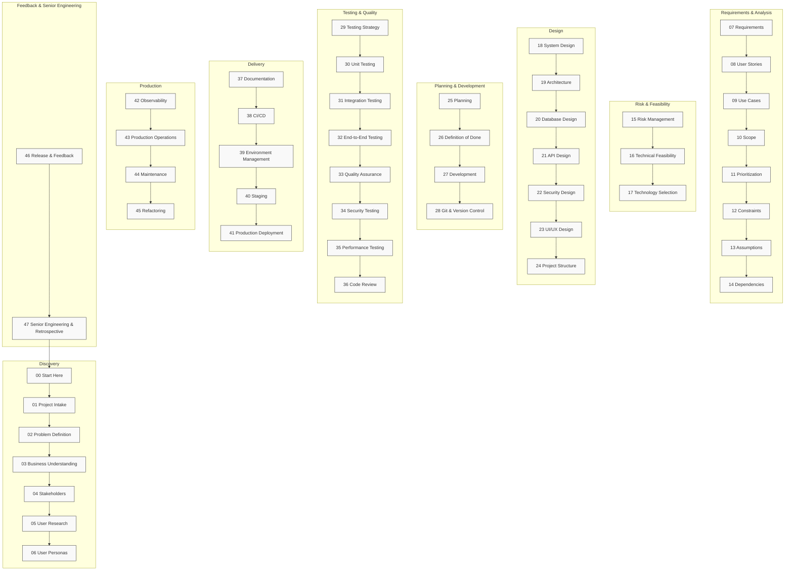

# Software Engineering Playbook


48 Phases • Engineering Process • Developer Learning • Architecture • Testing • Security • DevOps

> From Idea → Production → Engineering Excellence
>
> A complete software engineering process for understanding,
> designing, building, testing, deploying, operating,
> maintaining, and improving software systems.

## Navigation

- [What Is This?](#what-is-this)
- [Engineering Lifecycle](#engineering-lifecycle)
- [48 Phases](#48-phases)
- [Learning Paths](#learning-paths)
- [Engineering Artifacts](#engineering-artifacts)
- [Before You Write Code](#before-you-write-code)
- [After You Write Code](#after-you-write-code)
- [Junior vs Senior Thinking](#junior-vs-senior-thinking)
- [Quick Navigation](#quick-navigation)
- [FAQ](#faq)
- [Contributing](#contributing)
- [License](#license)

## What Is This?

This repository contains a **48-phase software engineering playbook** that guides developers through the entire lifecycle of building software systems—from initial idea to production operations and continuous improvement.

Each phase represents a distinct step in the professional software development process, complete with objectives, activities, and deliverables.

The playbook is designed to be:

- **Sequential**: Phases build upon each other
- **Iterative**: Feedback loops enable continuous improvement
- **Adaptable**: Apply the appropriate level of rigor based on project risk and complexity
- **Comprehensive**: Covers discovery, requirements, design, development, testing, delivery, operations, and senior engineering practices

## How Software Is Actually Built

Professional software development is **not** a linear process:

```text
Idea → Code → Done
```

Instead, it is a continuous engineering loop with multiple feedback cycles:

```mermaid
flowchart LR
    A[Idea/Opportunity] --> B[Discovery]
    B --> C[Requirements & Analysis]
    C --> D[Risk & Feasibility]
    D --> E[Design]
    E --> F[Planning]
    F --> G[Development]
    G --> H[Testing & Quality]
    H --> I[Review & Security]
    I --> J[CI/CD]
    J --> K[Staging]
    K --> L[Production]
    L --> M[Observability & Monitoring]
    M --> N[Feedback & Learning]
    N --> B
```



This loop ensures that software evolves based on real-world usage, changing requirements, and lessons learned.

## Engineering Lifecycle Diagram

The following diagram shows how the 48 phases fit into the traditional software engineering lifecycle grouped by major stages:



> **Note**: The diagram above shows the sequential flow. In practice, phases may overlap or iterate based on project needs.

## 48 Phases

Below is an interactive overview of all 48 phases. Click on any phase to jump directly to its directory.

<details>
<summary><strong>🔎 Discovery (Phases 00–06)</strong></summary>

| Phase | Purpose | Learn |
|-------|---------|-------|
| [00 — Start Here](./devlopment/00-START-HERE/) | Initialize your engineering journey | Mindset, goals, how to use this playbook |
| [01 — Project Intake](./devlopment/01-PROJECT-INTAKE/) | Understand the project context | Context, goals, inputs, success criteria |
| [02 — Problem Definition](./devlopment/02-PROBLEM-DEFINITION/) | Define the real problem to solve | Problem statements, root cause analysis |
| [03 — Business Understanding](./devlopment/03-BUSINESS-UNDERSTANDING/) | Understand business value and alignment | Goals, metrics, constraints, ROI |
| [04 — Stakeholders](./devlopment/04-STAKEHOLDERS/) | Identify and engage stakeholders | Stakeholder maps, communication plans |
| [05 — User Research](./devlopment/05-USER-RESEARCH/) | Research user needs and behaviors | Interviews, surveys, personas |
| [06 — User Personas](./devlopment/06-USER-PERSONAS/) | Create detailed user representations | Persona creation, empathy mapping |

</details>

<details>
<summary><strong>📋 Requirements & Analysis (Phases 07–14)</strong></summary>

| Phase | Purpose | Learn |
|-------|---------|-------|
| [07 — Requirements](./devlopment/07-REQUIREMENTS/) | Capture functional and non-functional requirements | Requirement types, tracing, prioritization |
| [08 — User Stories](./devlopment/08-USER-STORIES/) | Write effective user stories | INVEST criteria, acceptance criteria, splitting |
| [09 — Use Cases](./devlopment/09-USE-CASES/) | Model user-system interactions | Use case diagrams, scenarios, flows |
| [10 — Scope](./devlopment/10-SCOPE/) | Define what is in and out of scope | Scope statements, boundaries, change control |
| [11 — Prioritization](./devlopment/11-PRIORITIZATION/) | Prioritize work based on value and risk | MoSCoW, WSJF, value vs. effort |
| [12 — Constraints](./devlopment/12-CONSTRAINTS/) | Identify technical, business, and regulatory constraints | Constraint analysis, impact assessment |
| [13 — Assumptions](./devlopment/13-ASSUMPTIONS/) | Document and validate assumptions | Assumption logging, validation plans |
| [14 — Dependencies](./devlopment/14-DEPENDENCIES/) | Map internal and external dependencies | Dependency trees, risk mitigation |

</details>

<details>
<summary><strong>⚠️ Risk & Feasibility (Phases 15–17)</strong></summary>

| Phase | Purpose | Learn |
|-------|---------|-------|
| [15 — Risk Management](./devlopment/15-RISK-MANAGEMENT/) | Identify, analyze, and mitigate risks | Risk registers, mitigation strategies, monitoring |
| [16 — Technical Feasibility](./devlopment/16-TECHNICAL-FEASIBILITY/) | Assess whether the solution can be built | Prototyping, spike solutions, feasibility studies |
| [17 — Technology Selection](./devlopment/17-TECHNOLOGY-SELECTION/) | Choose appropriate technologies and tools | Evaluation criteria, proofs of concept, vendor selection |

</details>

<details>
<summary><strong>🏗️ Design (Phases 18–24)</strong></summary>

| Phase | Purpose | Learn |
|-------|---------|-------|
| [18 — System Design](./devlopment/18-SYSTEM-DESIGN/) | Define the overall system architecture | High-level design, components, interfaces |
| [19 — Architecture](./devlopment/19-ARCHITECTURE/) | Detail architectural styles and patterns | Layered, microservices, event-driven, modular |
| [20 — Database Design](./devlopment/20-DATABASE-DESIGN/) | Design data storage and retrieval | ER modeling, normalization, SQL/NoSQL |
| [21 — API Design](./devlopment/21-API-DESIGN/) | Design interfaces for system interaction | REST, GraphQL, versioning, documentation |
| [22 — Security Design](./devlopment/22-SECURITY-DESIGN/) | Build security into the architecture | Threat modeling, secure by design, controls |
| [23 — UI/UX Design](./devlopment/23-UI-UX-DESIGN/) | Design user interfaces and experiences | Wireframes, prototypes, usability principles |
| [24 — Project Structure](./devlopment/24-PROJECT-STRUCTURE/) | Organize code and repository structure | Monorepo, multi-repo, naming conventions |

</details>

<details>
<summary><strong>📅 Planning & Development (Phases 25–28)</strong></summary>

| Phase | Purpose | Learn |
|-------|---------|-------|
| [25 — Planning](./devlopment/25-PLANNING/) | Create project plans and estimates | Roadmaps, sprint planning, capacity planning |
| [26 — Definition of Done](./devlopment/26-DEFINITION-OF-DONE/) | Define completion criteria for work | Checklists, quality gates, acceptance |
| [27 — Development](./devlopment/27-DEVELOPMENT/) | Write clean, maintainable code | Coding standards, pair programming, TDD |
| [28 — Git & Version Control](./devlopment/28-GIT-VERSION-CONTROL/) | Manage source code effectively | Branching strategies, merge requests, hooks |

</details>

<details>
<summary><strong>🧪 Testing & Quality (Phases 29–36)</strong></summary>

| Phase | Purpose | Learn |
|-------|---------|-------|
| [29 — Testing Strategy](./devlopment/29-TESTING-STRATEGY/) | Plan testing approaches and levels | Test pyramid, automation, exploratory testing |
| [30 — Unit Testing](./devlopment/30-UNIT-TESTING/) | Test individual components in isolation | Test frameworks, mocking, coverage |
| [31 — Integration Testing](./devlopment/31-INTEGRATION-TESTING/) | Test interactions between components | Contract testing, service virtualization |
| [32 — End-to-End Testing](./devlopment/32-END-TO-END-TESTING/) | Test complete user workflows | UI testing, API testing, scenario-based |
| [33 — Quality Assurance](./devlopment/33-QUALITY-ASSURANCE/) | Ensure overall product quality | QA processes, defect management, metrics |
| [34 — Security Testing](./devlopment/34-SECURITY-TESTING/) | Identify vulnerabilities and weaknesses | SAST, DAST, penetration testing, fuzzing |
| [35 — Performance Testing](./devlopment/35-PERFORMANCE-TESTING/) | Evaluate system responsiveness and stability | Load testing, stress testing, scalability |
| [36 — Code Review](./devlopment/36-CODE-REVIEW/) | Improve code quality through peer review | Review checklists, feedback, knowledge sharing |

</details>

<details>
<summary><strong>🚀 Delivery (Phases 37–41)</strong></summary>

| Phase | Purpose | Learn |
|-------|---------|-------|
| [37 — Documentation](./devlopment/37-DOCUMENTATION/) | Create and maintain technical documentation | API docs, user guides, architecture decisions |
| [38 — CI/CD](./devlopment/38-CI-CD/) | Automate build, test, and deployment pipelines | Pipeline as code, triggers, rollback strategies |
| [39 — Environment Management](./devlopment/39-ENVIRONMENT-MANAGEMENT/) | Manage development, test, and prod environments | Infrastructure as code, environment parity |
| [40 — Staging](./devlopment/40-STAGING/) | Prepare for production release | Staging environments, smoke tests, approvals |
| [41 — Production Deployment](./devlopment/41-PRODUCTION-DEPLOYMENT/) | Release software to production safely | Deployment strategies, blue-green, canary |

</details>

<details>
<summary><strong>📡 Production (Phases 42–45)</strong></summary>

| Phase | Purpose | Learn |
|-------|---------|-------|
| [42 — Observability](./devlopment/42-OBSERVABILITY/) | Monitor system health and performance | Metrics, logging, tracing, alerting |
| [43 — Production Operations](./devlopment/43-PRODUCTION-OPERATIONS/) | Operate and maintain production systems | Runbooks, incident response, change management |
| [44 — Maintenance](./devlopment/44-MAINTENANCE/) | Sustain and improve existing systems | Bug fixes, patches, technical debt management |
| [45 — Refactoring](./devlopment/45-REFACTORING/) | Improve code without changing functionality | Code smells, refactoring techniques, safety |

</details>

<details>
<summary><strong>♻️ Feedback & Senior Engineering (Phases 46–47)</strong></summary>

| Phase | Purpose | Learn |
|-------|---------|-------|
| [46 — Release & Feedback](./devlopment/46-RELEASE-AND-FEEDBACK/) | Collect and analyze user feedback | Feedback loops, NPS, usage analytics |
| [47 — Senior Engineering & Retrospective](./devlopment/47-SENIOR-ENGINEERING-AND-RETROSPECTIVE/) | Apply engineering wisdom and improve process | Technical leadership, mentoring, retrospectives |

</details>

## Learning Paths

Choose a path based on your experience and goals:

### Beginner Path
Focus on the fundamentals of software engineering.

[00 → 07 → 10 → 18 → 25 → 27 → 28 → 29 → 36 → 37]

### Professional Developer Path
Apply structured engineering to real-world projects.

[00 → 17 → 18 → 24 → 28 → 29 → 36 → 38 → 41 → 42]

### Senior Engineer Path
Develop leadership and systems thinking skills.

[18 → 19 → 22 → 25 → 34 → 35 → 36 → 38 → 42 → 43 → 45 → 47]

### Complete Path
Experience the full 48-phase journey.

[00 → 47]

> **Tip**: Use the links above to navigate directly to the first phase in each path.

## What You Will Learn

Develop capabilities across the engineering spectrum:

```text
🧠 THINK
Problem solving • Requirements analysis • Trade-off evaluation • Engineering judgment

🏗️ DESIGN
System design • Architectural patterns • Database design • API design • Security principles

💻 BUILD
Clean code • Design patterns • Git workflows • Project structure • Development practices

🧪 VALIDATE
Testing strategies • Unit/integration/E2E testing • Quality assurance • Security testing • Performance testing

🚀 SHIP
CI/CD pipelines • Environment management • Staging • Deployment strategies • Release management

📡 OPERATE
Observability • Monitoring • Incident response • Reliability engineering • Production operations

♻️ IMPROVE
Maintenance strategies • Refactoring • Feedback incorporation • Retrospectives • Technical debt management
```

## Engineering Artifacts

Throughout the lifecycle, you will produce these key artifacts:

```text
DISCOVERY
→ Problem Statement • Stakeholder Map • User Research Notes • Personas

REQUIREMENTS
→ Requirements Document • User Stories • Use Cases • Scope Statement • Prioritized Backlog

DESIGN
→ System Design Document • Architecture Decision Records • Database Schema • API Specifications • Security Threat Model • UI Mockups • Project Structure Diagram

PLANNING
→ Project Roadmap • Sprint Plans • Definition of Done Checklist • Estimation Sheets

DEVELOPMENT
→ Source Code • Unit Tests • Integration Tests • Code Review Comments • Development Logs

DELIVERY
→ CI/CD Pipeline Configuration • Deployment Scripts • Release Notes • Environment Configurations

PRODUCTION
→ Monitoring Dashboards • Alerting Rules • Runbooks • Incident Reports • Postmortems

IMPROVEMENT
→ Retrospective Action Items • Technical Debt Register • Improvement Backlog • Feedback Summary
```

## Before You Write Code

> **Never jump straight into implementation.** Ensure these foundations are in place:

<details>
<summary><strong>✅ Pre-Development Checklist</strong></summary>

- [ ] Problem is well understood and validated
- [ ] User needs and personas are documented
- [ ] Requirements are clear, prioritized, and agreed upon
- [ ] Scope is defined and boundaries are set
- [ ] Major risks have been identified and mitigation planned
- [ ] Technical feasibility has been assessed
- [ ] Architecture and design decisions have been made
- [ ] Data model and API contracts are defined
- [ ] Security considerations have been addressed
- [ ] Testing strategy has been defined
- [ ] Deployment and rollback plans are prepared
- [ ] Observability requirements are specified
- [ ] Definition of Done is established

</details>

## After You Write Code

> Implementation is just the beginning. Follow this validation loop:

```mermaid
flowchart LR
    A[Code Complete] --> B[Unit Tests]
    B --> C[Integration Tests]
    C --> D[Code Review]
    D --> E[Security Scan]
    E --> F[CI Pipeline]
    F --> G[Staging Deployment]
    G --> H[Smoke Tests]
    H --> I[Production Deployment]
    I --> J[Monitoring]
    J --> K[Feedback Collection]
    K --> L[Issue Triage]
    L --> M[Bug Fixes/Improvements]
    M --> A
```



## Junior vs Senior Thinking

Understand how engineering maturity affects decision-making:

| Situation | Junior Thinking | Senior Thinking |
|-----------|-----------------|-----------------|
| **Feature Request** | "How do I code it?" | "Why do we need it? What problem does it solve?" |
| **Database Choice** | "Which database is trendy?" | "What data guarantees (consistency, availability) do we actually need?" |
| **API Design** | "How do I expose this functionality?" | "What contract should clients depend on? How will it evolve?" |
| **Security** | "Add authentication and call it done." | "What are the threat models, trust boundaries, and data classification requirements?" |
| **Performance** | "Make it run faster everywhere." | "Where is the actual bottleneck? What are the performance goals and measurements?" |
| **Architecture** | "Let's use microservices for everything." | "What problem requires service boundaries? What complexity are we introducing?" |
| **Production** | "Deploy it and move on." | "How do we detect failures, recover gracefully, and roll back when needed?" |
| **Technical Debt** | "We'll fix it later." | "What is the interest rate on this debt? When should we pay it down?" |
| **Feedback** | "Users don't know what they want." | "How can we validate assumptions and learn from real-world usage?" |

## Engineering Decision Tree

Use this diagram to determine next steps in the development process:

```mermaid
flowchart TD
    A[New Feature or Change] --> B{Problem Clearly Defined?}
    B -->|No| C[Return to Discovery Phases 00-06]
    B -->|Yes| D{Requirements Clear & Prioritized?}
    D -->|No| E[Clarify Requirements (Phases 07-14)]
    D -->|Yes| F{High Risk or Uncertainty?}
    F -->|Yes| G[Run Feasibility/Spike (Phases 15-17)]
    F -->|No| H[Proceed to Design (Phases 18-24)]
    G --> H
    H --> I[Create Implementation Plan (Phases 25-28)]
    I --> J[Develop & Test (Phases 27-36)]
    J --> K[Review & Security Check]
    K -->|Pass| L[CI/CD Pipeline (Phase 38)]
    L -->|Success| M[Staging Deployment (Phase 40)]
    M -->|Validation Pass| N[Production Deployment (Phase 41)]
    N --> O[Monitor & Observe (Phases 42-43)]
    O --> P[Collect Feedback (Phase 46)]
    P --> Q[Retrospective & Improve (Phase 47)]
    Q --> A
```

## Project Size & Engineering Rigor

Apply the appropriate level of process based on project characteristics:

| Engineering Area | Small Project | Medium Project | Large / High-Risk System |
|------------------|---------------|----------------|--------------------------|
| **Requirements** | Lightweight backlog | Structured backlog with user stories | Formal requirements traceability |
| **Architecture** | Simple monolith or serverless | Well-layered or modular monolith | Formal architecture (e.g., TOGAFE, microservices) |
| **Security** | Basic input validation & auth | Structured threat modeling & periodic scans | Comprehensive security program (red team, audits) |
| **Testing** | Essential unit & manual tests | Comprehensive test automation | Multi-layer testing (unit, integration, E2E, perf, security) |
| **Observability** | Basic logging & error reporting | Standard metrics & health checks | Advanced observability (distributed tracing, SLOs) |
| **Documentation** | Essential inline docs | Detailed API & architecture docs | Extensive documentation (runbooks, playbooks) |
| **Disaster Recovery** | Sometimes considered | Usually included in design | Required with tested RTO/RPO |

> **Remember**: Good engineering is not about following process for its own sake—it's about applying the right rigor to match the risk and complexity.

## One Feature Through the Entire Lifecycle

Follow how a "password reset" feature moves through the playbook:

```text
Problem
   Users report being locked out of accounts
   ↓
Requirement
   As a user, I can reset my password via email
   ↓
User Story
   [As a registered user] I want to reset my password so that I can regain access to my account when I forget it.
   ↓
Use Case
   User clicks "Forgot Password" → enters email → receives reset link → sets new password → logs in
   ↓
Scope
   Limited to email-based reset (no SMS or security questions in v1)
   ↓
Risk
   Security risk: account enumeration, weak tokens, expired links
   ↓
Technology Selection
   Choose secure token library, email service provider
   ↓
Security Design
   Implement rate limiting, expiration, one-time tokens, audit logging
   ↓
API Design
   POST /auth/reset-request, POST /auth/reset-confirm with token validation
   ↓
Database Design
   Add password_reset_tokens table with expiry and usage tracking
   ↓
Implementation
   Write backend services, API controllers, email integration
   ↓
Testing
   Unit tests for token generation, integration tests for API flow, security tests for brute force
   ↓
Code Review
   Peer review focusing on security flaws and edge cases
   ↓
CI/CD
   Automated tests run on every commit, deployment to staging
   ↓
Staging
   Smoke test the reset flow with test email accounts
   ↓
Production
   Deploy to production with feature flag for gradual rollout
   ↓
Observability
   Monitor reset request rates, success/failure metrics, alert on anomalies
   ↓
Feedback
   Track user satisfaction via post-reset survey, monitor support tickets
   ↓
Improvement
   Analyze feedback, identify edge cases (e.g., expired tokens), plan enhancements
```

## Interactive Checklists

Use these checklists to ensure quality at each stage:

<details>
<summary><strong>📝 Development Checklist</strong></summary>

- [ ] Code follows established style guides
- [ ] All new code has unit tests
- [ ] Side effects are minimized and pure functions preferred
- [ ] Error handling is comprehensive
- [ ] Logging is appropriate for debugging and auditing
- [ ] Performance implications considered
- [ ] Security best practices applied (input validation, output encoding)
- [ ] Dependencies are up-to-date and licensed appropriately
- [ ] Documentation is updated (code comments, API docs)

</details>

<details>
<summary><strong>🔍 Code Review Checklist</strong></summary>

- [ ] Does the code solve the intended problem?
- [ ] Are requirements fully met?
- [ ] Is the code readable and maintainable?
- [ ] Are edge cases handled?
- [ ] Is there adequate test coverage?
- [ ] Are security vulnerabilities absent?
- [ ] Are performance implications acceptable?
- [ ] Does it follow architectural patterns?
- [ ] Are dependencies justified and safe?
- [ ] Is documentation updated where needed?

</details>

<details>
<summary><strong>🚦 Pre-Production Checklist</strong></summary>

- [ ] All tests pass in CI pipeline
- [ ] Security scan shows no critical vulnerabilities
- [ ] Performance benchmarks met
- [ ] Deployment scripts tested in staging
- [ ] Rollback procedures documented and tested
- [ ] Monitoring alerts configured
- [ ] Runbooks updated for new functionality
- [ ] Stakeholder sign-off obtained (if required)

</details>

## AI-Assisted Development

> **Use AI to accelerate, not replace, engineering judgment.**

```text
Developer
   ↓
Problem Understanding (Phases 00-06)
   ↓
Requirements & Analysis (Phases 07-14)
   ↓
Architecture & Design (Phases 18-24)
   ↓
AI Assistance
   ↓
Code Generation (Phase 27)
   ↓
Human Review (Phase 36)
   ↓
Testing (Phases 29-35)
   ↓
Security Checks (Phase 34)
   ↓
Production Deployment (Phase 41)
   ↓
Observability (Phase 42)
```

**Principles for working with AI:**
1. **Understand first**: Never let AI write code for a problem you don't understand
2. **Architectural control**: AI assists within human-defined architectural boundaries
3. **Review everything**: Treat AI-generated code as if written by a junior developer
4. **Test thoroughly**: Apply the same testing standards to AI-assisted code
5. **Own the outcome**: You remain responsible for correctness, security, and performance

## Visual Engineering Stack

Conceptual layers of a software system:

```mermaid
flowchart TB
    subgraph Users["Business / Users"]
        direction TB
        U1[User Needs] --> U2[Business Goals] --> U3[Market Demands]
    end

    subgraph Reqs["Requirements"]
        direction TB
        R1[Functional] --> R2[Non-functional] --> R3[Regulatory]
    end

    subgraph Design["System / Architecture"]
        direction TB
        D1[High-Level Design] --> D2[Architectural Patterns] --> D3[Component Design]
    end

    subgraph Interfaces["API / Data / Security"]
        direction TB
        I1[API Contracts] --> I2[Data Models] --> I3[Security Mechanisms]
    end

    subgraph App["Application"]
        direction TB
        A1[Core Logic] --> A2[Business Rules] --> A3[Integration Code]
    end

    subgraph Tests["Tests / Quality"]
        direction TB
        T1[Unit Tests] --> T2[Integration Tests] --> T3[End-to-End Tests] --> T4[Performance] --> T5[Security]
    end

    subgraph Infra["CI/CD / Infrastructure"]
        direction TB
        IaC[Infrastructure as Code] --> Pipelines[CI/CD Pipelines] --> Envs[Environment Management]
    end

    subgraph Prod["Production / Operations"]
        direction TB
        O1[Monitoring] --> O2[Logging] --> O3[Tracing] --> O4[Alerting] --> O5[Incident Response] --> O6[Runbooks]
    end

    subgraph Feedback["Observability / Feedback"]
        direction TB
        F1[Metrics] --> F2[Logs] --> F3[Traces] --> F4[User Analytics] --> F5[Support Tickets] --> F6[Retrospectives]
    end

    Users --> Reqs --> Design --> Interfaces --> App --> Tests --> Infra --> Prod --> Feedback
    style Users fill:#e3f2fd,stroke:#1565c0,stroke-width:1px
    style Reqs fill:#fff3e0,stroke:#ef6c00,stroke-width:1px
    style Design fill:#e8f5e8,stroke:#2e7d32,stroke-width:1px
    style Interfaces fill:#f3e5f5,stroke:#6a1b9a,stroke-width:1px
    style App fill:#ffebee,stroke:#c62828,stroke-width:1px
    style Tests fill:#e0f7fa,stroke:#006064,stroke-width:1px
    style Infra fill:#fffde7,stroke:#f57f17,stroke-width:1px
    style Prod fill:#f1f8e9,stroke:#33691e,stroke-width:1px
    style Feedback fill:#fce4ec,stroke:#880e4f,stroke-width:1px
```



## Quick Navigation

Jump to key areas of the playbook:

- [🚀 Start Here](./devlopment/00-START-HERE/)
- [📋 Requirements](./devlopment/07-REQUIREMENTS/)
- [🏗️ System Design](./devlopment/18-SYSTEM-DESIGN/)
- [🏛️ Architecture](./devlopment/19-ARCHITECTURE/)
- [🗄️ Database](./devlopment/20-DATABASE-DESIGN/)
- [🔌 API](./devlopment/21-API-DESIGN/)
- [🔐 Security](./devlopment/22-SECURITY-DESIGN/)
- [💻 Development](./devlopment/27-DEVELOPMENT/)
- [🌿 Git](./devlopment/28-GIT-VERSION-CONTROL/)
- [🧪 Testing](./devlopment/29-TESTING-STRATEGY/)
- [🔍 Code Review](./devlopment/36-CODE-REVIEW/)
- [🚀 CI/CD](./devlopment/38-CI-CD/)
- [🌍 Environments](./devlopment/39-ENVIRONMENT-MANAGEMENT/)
- [📦 Deployment](./devlopment/41-PRODUCTION-DEPLOYMENT/)
- [📡 Observability](./devlopment/42-OBSERVABILITY/)
- [🚨 Production Operations](./devlopment/43-PRODUCTION-OPERATIONS/)
- [🔧 Maintenance](./devlopment/44-MAINTENANCE/)
- [♻️ Refactoring](./devlopment/45-REFACTORING/)
- [🧠 Senior Engineering](./devlopment/47-SENIOR-ENGINEERING-AND-RETROSPECTIVE/)

## Frequently Asked Questions

<details>
<summary><strong>Do I need to complete all 48 phases?</strong></summary>

No. The playbook is comprehensive, but you should apply the appropriate level of rigor based on:
- Project size and complexity
- Risk profile (technical, business, regulatory)
- Team experience and maturity
- Time-to-market constraints

Use the learning paths as starting points, then adapt as needed.
</details>

<details>
<summary><strong>Where should a beginner start?</strong></summary>

Begin with the **Beginner Path** (00 → 07 → 10 → 18 → 25 → 27 → 28 → 29 → 36 → 37) to build foundational skills, then progress to the Professional Developer Path as you gain experience.
</details>

<details>
<summary><strong>Is this programming-language specific?</strong></summary>

No. The playbook focuses on engineering principles that apply regardless of language or technology stack. Specific implementation details (examples, tooling) may reference common technologies, but the concepts are universal.
</details>

<details>
<summary><strong>Can I use this for mobile development?</strong></summary>

Yes. The phases apply to mobile apps just as they do to web or backend systems. Adjust the deliverables (e.g., UI/UX design for mobile, platform-specific testing) as needed.
</details>

<details>
<summary><strong>Can I use this with AI coding tools?</strong></summary>

Yes, but follow the **AI-Assisted Development** section above: use AI to accelerate implementation within human-defined architectural boundaries, and always apply rigorous human review and testing.
</details>

<details>
<summary><strong>Is this a project template or tutorial?</strong></summary>

Neither. This is an **engineering process framework**—a mental model for how professional software is built. It teaches the *why* behind each activity, not just the *how*.
</details>

<details>
<summary><strong>How do I use the checklists?</strong></summary>

Use them as conversation starters and quality gates:
- **Before starting work**: Review the Pre-Development Checklist
- **During development**: Refer to the Development Checklist
- **Before merging**: Run through the Code Review Checklist
- **Before release**: Complete the Pre-Production Checklist

Adapt them to your team's specific needs and context.
</details>

## Contributing

We welcome contributions to improve this playbook! Please follow these guidelines:

1. Fork the repository
2. Create a feature branch (`git checkout -b feature/amazing-improvement`)
3. Make your changes
4. Ensure all links remain valid and diagrams render correctly
5. Commit your changes (`git commit -am 'Add amazing feature'`)
6. Push to the branch (`git push origin feature/amazing-improvement`)
7. Open a Pull Request

Please ensure your contributions align with the engineering principles outlined in this playbook.

## License

This project is licensed under the MIT License - see the [LICENSE](LICENSE) file for details.

---

*Built with ❤️ by developers who believe that great software is engineered, not just written.*
